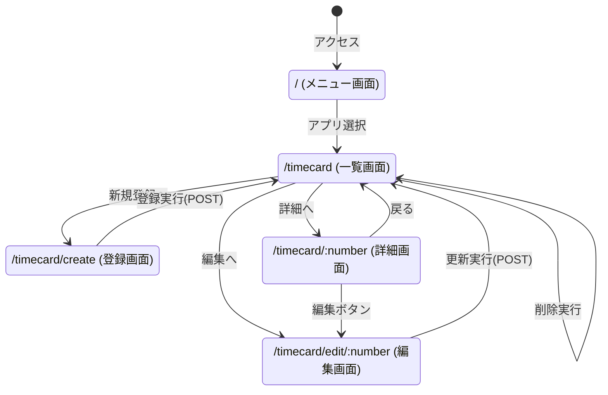

```mermaid
stateDiagram-v2
    [*] --> Top : アクセス
    state "/ (メニュー画面)" as Top

    Top --> List : アプリ選択
    state "/timecard (一覧画面)" as List

    List --> Create : 新規登録へ
    state "/timecard/create (登録画面)" as Create
    Create --> List : 登録実行(POST)

    List --> Detail : 詳細へ
    state "/timecard/:number (詳細画面)" as Detail
    Detail --> List : 戻る

    List --> Edit : 編集へ
    state "/timecard/edit/:number (編集画面)" as Edit
    Edit --> List : 更新実行(POST)
    
    Detail --> Edit : 編集ボタン
    List --> List : 削除実行
```